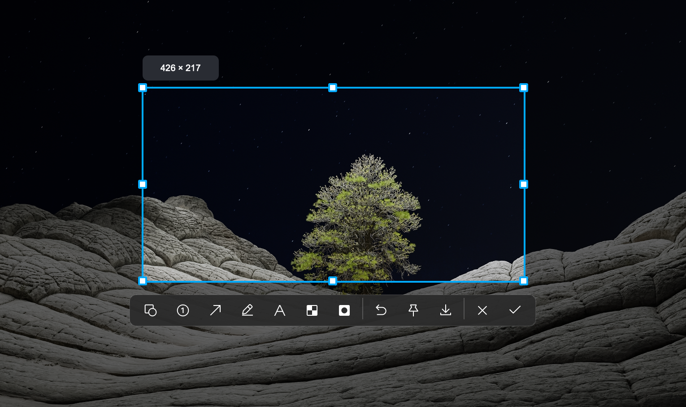
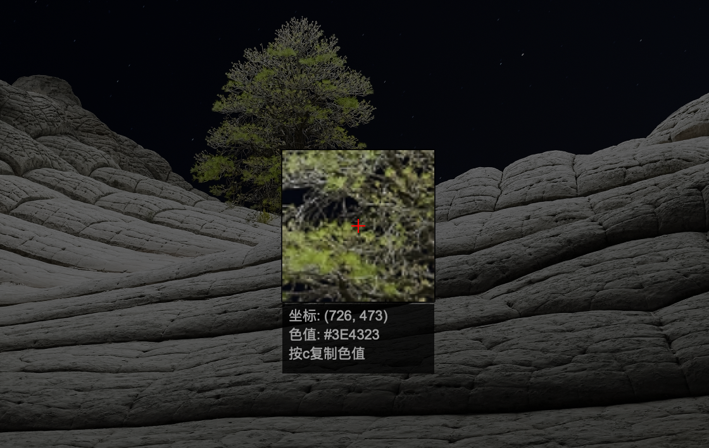

# OpenCap - 现代化截图工具

[](https://opensource.org/licenses/Apache-2.0)
[](https://www.qt.io/)
[](https://github.com/yourusername/openCap)
[](https://isocpp.org/)
[](https://cmake.org/)

一个基于 Qt6 和 C++17 开发的现代化截图工具，提供流畅的屏幕截图体验。



## ✨ 主要功能

- 🎯 **智能截图**: 支持区域选择、全屏截图和窗口截图
- 📱 **系统托盘集成**: 后台运行，通过系统托盘快速访问
- 🖼️ **实时预览**: 截图时实时显示选择区域和坐标信息
- 🎨 **现代化界面**: 基于 Qt6 的现代化用户界面
- ⌨️ **快捷键支持**: 支持全局快捷键和键盘操作
- 💾 **多种保存方式**: 支持保存到文件、复制到剪贴板
- 🔍 **高分辨率支持**: 完美支持 Retina 和高分辨率显示器
- 🍎 **原生 macOS 集成**: 使用 Cocoa API 实现最佳系统集成
- ⌨️ **原生 体积小**: 只有 400 多 K，占用内存极小

## 🏗️ 技术架构

### 核心技术栈

- **Qt6**: 跨平台 GUI 框架
- **C++17**: 现代 C++ 标准
- **CMake**: 现代化构建系统
- **Objective-C++**: macOS 原生 API 集成

### 项目结构

```
openCap/
├── src/                    # 源代码
│   ├── main.cpp           # 应用程序入口
│   ├── screenshot/        # 截图核心功能
│   │   ├── core/         # 核心应用逻辑
│   │   ├── managers/     # 功能管理器
│   │   └── ui/           # 用户界面组件
│   ├── system/           # 系统集成
│   ├── platform/         # 平台特定代码
│   └── utils/            # 工具类
├── scripts/              # 构建和开发脚本
├── docs/                 # 项目文档
└── CMakeLists.txt        # 构建配置
```

## 🚀 快速开始

### 系统要求

- **操作系统**: macOS 12.0+, Windows 10+, Linux (实验性)
- **Qt**: Qt6.2 或更高版本
- **编译器**: 支持 C++17 的编译器 (GCC 7+, Clang 5+, MSVC 2017+)
- **构建工具**: CMake 3.16+

### 安装依赖

**macOS**:

```bash
# 使用 Homebrew 安装依赖
brew install qt6 cmake

# 或者使用 Qt 官方安装器
# 下载并安装 Qt6.2+ from https://www.qt.io/download
```

**Ubuntu/Debian**:

```bash
sudo apt update
sudo apt install build-essential cmake qt6-base-dev qt6-svg-dev
```

**Windows**:

```bash
# 安装 Visual Studio 2019+ 和 Qt6
# 或使用 vcpkg
vcpkg install qt6
```

### 构建项目

```bash
# 克隆项目
git clone https://github.com/yourusername/openCap.git
cd openCap

# 创建构建目录
./scripts/rebuild.sh

# 运行应用
./build/openCap.app/Contents/MacOS/openCap  # macOS
# 或
./build/openCap  # Linux/Windows

```

### 开发模式

项目提供了便捷的开发脚本：

```bash
# 开发模式（自动重新编译，会执行make、cmake）
./scripts/dev_watch.sh

# 构建监控模式 监听build文件夹 重启程序
./scripts/build_watch.sh

# 重新构建(添加了文件，会执行make、cmake)
./scripts/rebuild.sh
```

## 📖 使用指南

### 首次设置

1. **授予权限** (macOS):

   - 前往 "系统偏好设置 → 安全性与隐私 → 隐私 → 屏幕录制"
   - 添加 OpenCap 到允许列表

2. **启动应用**:
   - 运行编译后的可执行文件
   - 应用将在系统托盘显示图标

### 基本操作

- **开始截图**: 双击系统托盘图标或右键选择"截图"
- **选择区域**: 鼠标拖拽选择截图区域
- **完成截图**: 释放鼠标自动保存，或按 Enter 键
- **取消截图**: 按 ESC 键
- **退出应用**: 右键系统托盘图标选择"退出"

### 高级功能

- **全局快捷键**: Cmd+Shift+A (macOS) 快速截图
- **颜色拾取**: 按 C 复制到剪切板
- **剪贴板**: 点 ok 复制到系统剪贴板
- **文件保存**: 选择文件夹保存图片

## 🛠️ 开发指南

### 代码结构

项目采用模块化设计，主要组件包括：

- **ScreenshotApp**: 主应用程序类
- **ScreenshotOverlay**: 截图覆盖层界面
- **ScreenshotProcessor**: 截图处理和保存
- **SystemTray**: 系统托盘管理
- **SelectionManager**: 区域选择管理

### 调试技巧

```bash
# 调试模式构建
cmake -DCMAKE_BUILD_TYPE=Debug ..
cmake --build .

# 使用 GDB/LLDB 调试
lldb ./build/openCap.app/Contents/MacOS/openCap
```

## 🤝 贡献指南

我们欢迎所有形式的贡献！

### 贡献流程

1. Fork 项目仓库
2. 创建功能分支 (`git checkout -b feature/amazing-feature`)
3. 提交更改 (`git commit -m 'Add amazing feature'`)
4. 推送到分支 (`git push origin feature/amazing-feature`)
5. 创建 Pull Request

### 代码规范

- 遵循现有的代码风格和命名约定
- 添加适当的注释和文档
- 确保代码通过所有测试
- 更新相关文档

### 报告问题

请使用 GitHub Issues 报告 bug 或提出功能请求，并包含：

- 操作系统和版本信息
- Qt 版本
- 详细的错误描述和重现步骤

## 📦 打包发布

项目提供了打包脚本：

```bash
# macOS ARM 架构打包
./scripts/package_arm.sh

# macOS Intel 架构打包
./scripts/package_intel.sh
```

## 📄 许可证

本项目采用 Apache 2.0 许可证 - 查看 [LICENSE](LICENSE) 文件了解详情。

## 🙏 致谢

- 感谢 [Qt](https://www.qt.io/) 团队提供的优秀跨平台框架
- 感谢所有贡献者的辛勤工作
- 灵感来源于现代截图工具的用户体验设计

## 📞 联系我们

- **项目主页**: [GitHub Repository](https://github.com/yourusername/openCap)
- **问题反馈**: [GitHub Issues](https://github.com/yourusername/openCap/issues)
- **讨论交流**: [GitHub Discussions](https://github.com/yourusername/openCap/discussions)

---

⭐ **如果这个项目对您有帮助，请给我们一个 Star！**
